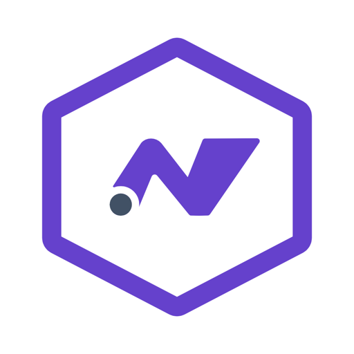

# .NET App Publisher



.NET App Publisher is a desktop utility for .NET developers who want a faster, safer way to build publish commands, inspect exactly what will run, and handle common platform workflows without living in the terminal.

It is built with Avalonia and currently supports Android, macOS, Windows, and iOS publish workflows for .NET projects.

## What it does

- Select a .NET project folder and auto-detect the `.csproj`
- Read project metadata and pick platform-appropriate target framework/runtime combinations
- Generate Android APK, AAB, or both
- Generate macOS outputs with optional `.app` bundle creation
- Generate Windows publish outputs with `.exe` launcher support
- Generate iOS publish commands with archive/IPA toggles
- Toggle platform-specific publish settings including trimming, AOT, linker/shrinker, and cleanup behavior
- Preview the exact `dotnet publish` command before running it
- Stream live publish output in the app
- Open the publish folder
- Install, uninstall, and launch the app through `adb`
- Discover available Android emulators and launch the one you want
- Capture the app window to clipboard or disk with a visible countdown
- Publish Android App Bundles to Google Play from a dedicated Google Play workspace
- Configure the Google Desktop OAuth client ID directly in the app, with session-only or user-profile persistence and visible configured/not-configured status
- Connect a personal Google account with browser OAuth, choose internal, closed, open, or production tracks, add release notes, and submit staged or full rollouts
- Keep Google OAuth tokens and Android upload-key passwords in memory for the current session; use **Clear session** or quit to remove them

## Why this exists

MAUI Android publish commands can become long and easy to get wrong, especially when switching between safer test builds and more aggressive optimized builds. This app keeps the command visible, keeps the options grouped in one place, and helps you iterate faster without losing track of what changed.

## Getting started

### Requirements

- .NET 10 SDK (the repository `global.json` pins the .NET 10 feature band)
- Android SDK command-line tools
- `adb` available on `PATH` for emulator install/launch actions
- Android `emulator` tool available on `PATH` or in the default SDK install location for AVD discovery and launch

### Run locally

```bash
dotnet build DotNetAppPublisher.slnx
dotnet run --project src/DotNetAppPublisher/DotNetAppPublisher.Desktop/DotNetAppPublisher.Desktop.csproj
dotnet run --project src/DotNetAppPublisher/DotNetAppPublisher.Browser/DotNetAppPublisher.Browser.csproj
```

## Commands

| Command | Purpose |
| --- | --- |
| `dotnet restore DotNetAppPublisher.slnx` | Restore NuGet packages |
| `dotnet build DotNetAppPublisher.slnx` | Build the solution |
| `dotnet run --project src/DotNetAppPublisher/DotNetAppPublisher.Desktop/DotNetAppPublisher.Desktop.csproj` | Launch the desktop app |
| `dotnet run --project src/DotNetAppPublisher/DotNetAppPublisher.Browser/DotNetAppPublisher.Browser.csproj` | Launch the browser host |
| `dotnet run --project tests/DotNetAppPublisher.Tests/DotNetAppPublisher.Tests.csproj` | Run the TUnit test suite |

### Main workflow

1. Pick the .NET project directory.
2. Review the detected `.csproj`, package id, and target framework.
3. Choose platform (`Android`, `macOS`, `Windows`, or `iOS`) and set the publish options for that slice.
4. Confirm the command preview looks correct.
5. Configure Android signing and the Google Play upload key from the Signing workspace.
6. Publish and watch the live output panel.
7. Open the output folder or push the build to an emulator.

## Project structure

```text
DotNetAppPublisher/
├── .github/
│   └── workflows/
├── docs/
│   └── dotnet-app-publisher-icon.png
├── tests/
│   ├── Directory.Packages.props
│   └── DotNetAppPublisher.Tests/
├── DotNetAppPublisher.slnx
└── src/
    └── DotNetAppPublisher/
        ├── DotNetAppPublisher/
        │   └── Features/
        │       ├── GooglePlay/
        │       │   ├── Authentication/
        │       │   ├── Releases/
        │       │   ├── Setup/
        │       │   ├── Signing/
        │       │   ├── State/
        │       │   └── Tracks/
        │       ├── Publishing/
        │       │   ├── Artifacts/
        │       │   ├── Build/
        │       │   ├── Capture/
        │       │   ├── Configure/
        │       │   ├── Inspect/
        │       │   └── Process/
        │       ├── Deployment/
        │       └── Shared/
        ├── DotNetAppPublisher.Browser/
        └── DotNetAppPublisher.Desktop/
```

## GitHub Actions

This repository includes Actions workflows for:

- CI validation on pushes and pull requests
- cross-platform desktop publish packaging on version tags

That gives the repo a solid starting point for sharing on GitHub without having to set up the basics later.

## Roadmap and wishlist

### Publish workflows

- Add guided presets for safe test builds, store-ready Android builds, and repeatable release profiles
- Add validation rules that disable unsupported combinations before publish
- Add saved publish profiles per project

### Google Play support

The current Google Play slice provides a dedicated workspace for:

- personal Google account OAuth with session-only credentials
- internal, closed, open, and production tracks
- localized release notes and staged or full rollouts
- AAB structure preflight, upload, commit, and status checks
- in-memory upload-key setup from the Signing workspace, linked from the Google Play release card
- clear-session controls for OAuth and signing material

Google Play app creation, legal declarations, Play App Signing enrollment, production-access applications, managed publishing, and upload-key resets still require Play Console.

### Signing improvements

- Add better keystore validation before publish starts
- Add secure secret storage integration instead of plain text fields
- Add signing key rotation helpers
- Add automation for switching between debug, local release, and store signing identities

### Platform expansion

- Add iOS simulator discovery and launch
- Add richer iOS signing/export profile support
- Add Windows installer packaging presets
- Add platform-specific validation so unsupported options are hidden or disabled automatically

## Current status

The app is already useful for Android, macOS, Windows, and iOS publish flows, plus Android emulator checks, but it is still evolving. The roadmap above reflects the next useful improvements for shipping and store workflows.

## Development notes

- The SDK and publishing profile analysis, including .NET 10/.NET 11 compatibility, platform matrices, and tested publish combinations, is recorded in [docs/dotnet-10-11-publishing-research.md](docs/dotnet-10-11-publishing-research.md).
- The repository pins the supported .NET 10 LTS SDK line with `global.json`; .NET 11 RC tooling is not selected accidentally while it is still a release candidate.
- Google Play publishing requires an existing Play app and a public Google Desktop OAuth client ID. The client secret is never needed or stored by the desktop OAuth flow.
- The Google Play setup card can set the client ID, Java home, and Android SDK path for this app process, save supported values for future launches, remove them, open Google Cloud credentials, and open setup help. Each setup row includes step-by-step acquisition guidance and an official source link. On macOS, **Save** updates `~/.zprofile`; open a new terminal or restart the app to load it. On Linux, use **Use now** because this app does not modify shell startup files. Environment values are never written to the app database.
- The Google Play account card stays at the top of the release workspace; upload-key controls are grouped under Signing and link back from the App card.
- Raw OAuth tokens, service-account keys, and keystore passwords are never shown in command previews or persisted by the Google Play slice. Session credentials are cleared when the window closes.
- New Play apps, legal declarations, production access, managed publishing, and signing-key resets remain manual Play Console actions when the supported API does not expose them.
- Some .NET projects override trim-related properties in custom ways. .NET App Publisher detects common project-specific trim property patterns so AOT and trimming combinations can be emitted correctly.
- The browser host uses Avalonia's software renderer, synchronizes its canvas backing store after startup, and disables desktop-only device discovery, elevated processes, file browsing, and Google OAuth in browser mode.
- The master-detail view narrows its navigation, stacks header actions, wraps form groups, and uses compact icon controls for low-emphasis actions at smaller window sizes.
- `Signing` and `Google Play` are adjacent master-detail destinations; routine status stays inline, while modal alerts are reserved for errors and confirmations with a title and vertically centered details.
- Release verification uses `dotnet restore -p:Configuration=Release`, a Release solution build, and the TUnit suite; no live Google Play or device calls are made by tests.

## Contributing

Small focused improvements are welcome, especially around publish validation, emulator ergonomics, packaging support, and release automation.

See [CONTRIBUTING.md](CONTRIBUTING.md) for local setup and pull request expectations.

## License

This project is licensed under the MIT License. See [LICENSE](LICENSE).
